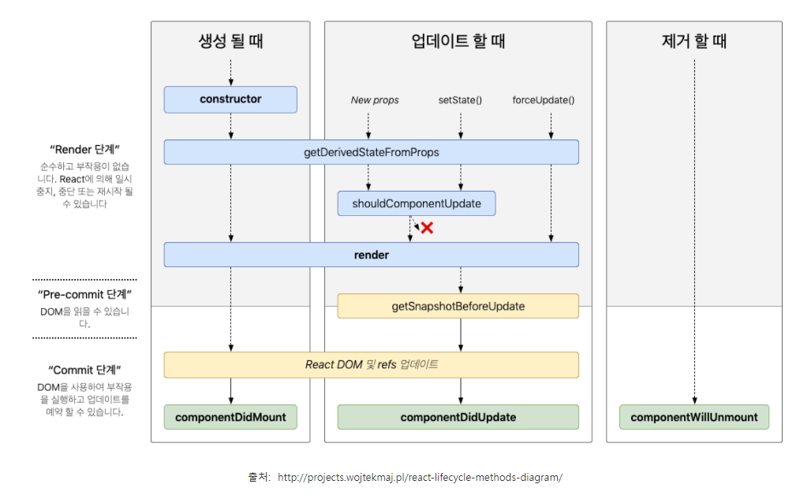

# useEffect

### useEffect란

기본적으로 몇가지 조건에 의해 작동된다.

```
첫째, 페이지가 렌더링 되고 난 후 useEffect함수는 무조건 한 번 실행된다.
```

```
둘째, useEffect배열로 지정한 useState의 값이 변경되면 실행된다.
```

즉 useEffect는 렌더링, 혹은 변수의 값이 바뀌면 그것을 인지하고 업데이트를 해주는 함수이다.
useEffect는 콜백을 부르고, 렌더링 혹은 값, 오브젝트의 변경에 따라 어떠한 함수 혹은 여러 개의 함수들을 동작시킬 수 있습니다.

#### 리액트 컴포넌트가 렌더링 될 때마다 특정 작업을 실행할 수 있도록 하는 Hook 이다.



#### useEffect는 component가 mount 됐을 때, component가 unmount 됐을 때, component가 update 됐을 때, 특정 작업을 처리할 수 있다.

즉, 클래스형 컴포넌트에서 사용할 수 있었던 생명주기 메소드를 함수형 컴포넌트에서도 사용할 수 있게 되었다.
